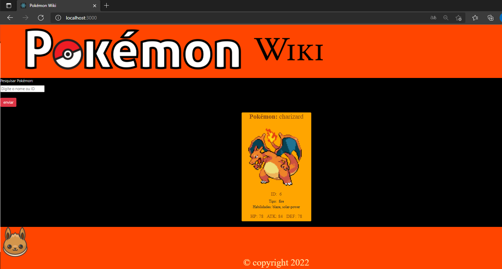

# Indice

- [Sobre](#-sobre)
- [Tecnologias Utilizadas](#-tecnologias-utilizadas)
- [Criando o projeto](#-criando-o-projeto)

## 🔖&nbsp; Sobre

O projeto desenvolvido é uma pagina web, que foi criada para buscas de informações Pokemón na API pokeapi.co.


<p align="center">
  <kbd>
    
  </kbd>
  &nbsp;&nbsp;&nbsp;&nbsp;
</p>

## 🚀 Tecnologias utilizadas

O projeto foi desenvolvido utilizando as seguintes tecnologias

- [React JS](https://pt-br.reactjs.org/)
- [AXIOS](https://axios-http.com/docs/intro)
- [Styled - Components](https://styled-components.com/)

## 🗂 Criando o projeto

```bash


    # Criar o repositório
    $ yarn create react-app my-app

    # Instalar as ferramentas
    $ yarn add axios
    $ yarn add styled-components
   

    # Iniciar o projeto
    $ yarn start 
  ```
  ---
    
    🚀 Desenvolvido por Luís Henrique.
   
   
   
